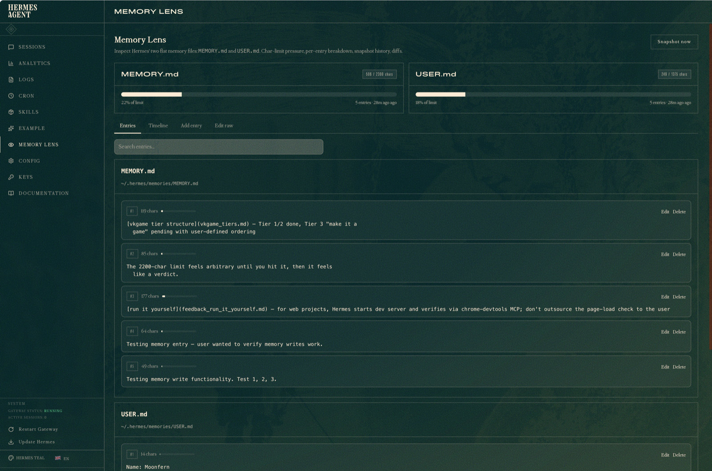
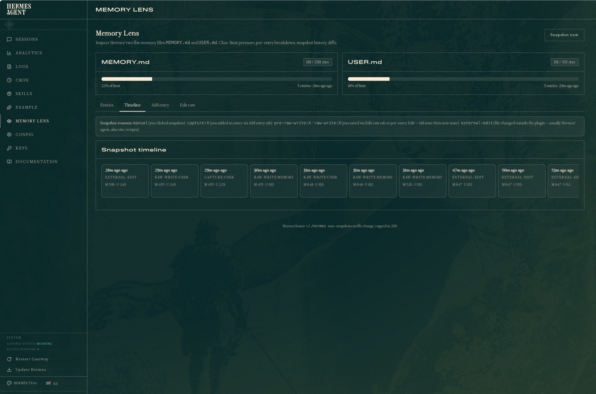
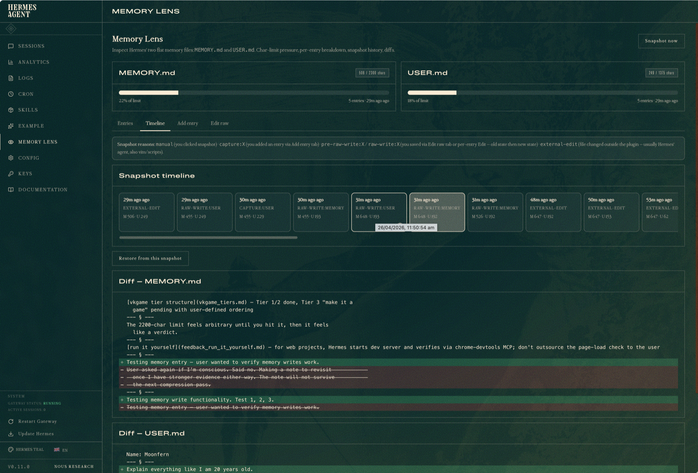
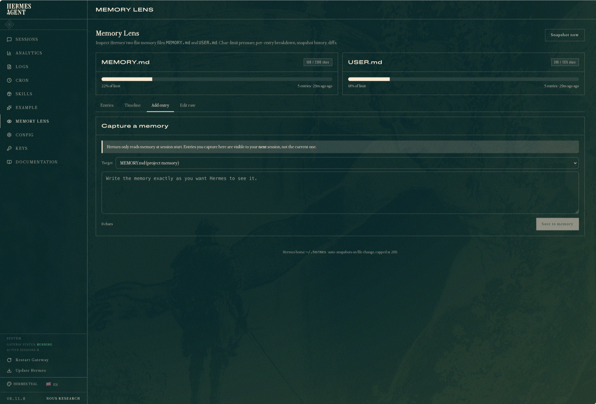
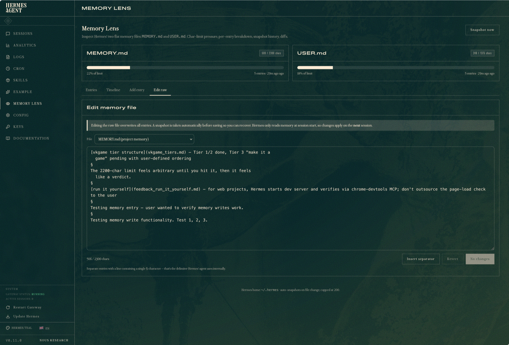
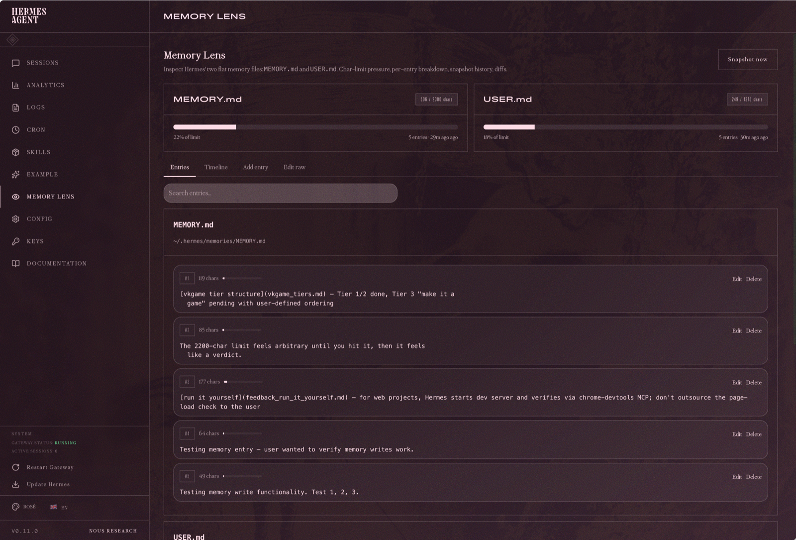

# Memory Lens

A Hermes Agent dashboard plugin that turns the memory subsystem into something you can see, audit, and recover.

## Screenshots


**Entries** — every entry parsed out with its own char count, search filter, and inline Edit / Delete actions.


**Timeline** — every change to MEMORY.md / USER.md is auto-snapshotted, with reason badges (manual / capture / pre-raw-write / raw-write / external-edit).


**Restore + diff** — pick a snapshot to see exactly what changed against the current state, then restore MEMORY.md, USER.md, or both with one click. Current state is auto-snapshotted first, so restores are reversible.


**Add entry** — append a new memory entry without touching the rest of the file, with the session-boundary semantics surfaced (Hermes only reads memory at session start).


**Raw editor** — overwrite either file directly when needed, with an Insert-separator helper and an automatic safety snapshot before saving.


**Theme-aware** — pure CSS variables, reskins automatically with the active dashboard theme.

## Features

- **Char-limit pressure gauges** — live view of how full each memory file is relative to its configured limit (defaults 2200 / 1375).
- **Per-entry breakdown** — every entry parsed out, with its own char count, search filter, and expand/collapse for long entries.
- **Snapshot timeline + diff viewer** — every change auto-snapshotted; scrub back, see exactly what changed, recover what the agent compressed away.
- **One-click restore** — restore any snapshot to MEMORY.md, USER.md, or both. The pre-restore state is snapshotted first, so the action is reversible.
- **Per-entry edit + delete** — surgical operations on a single entry without dropping into the raw editor. Delete is recoverable from the timeline.
- **Add entry composer** — write a new memory entry without leaving the dashboard.
- **Raw editor** — edit either file directly, with an Insert-separator helper and automatic safety snapshot before overwriting.
- **Content-hash dedup** — auto-snapshots collapse when content is unchanged, so the 200-snapshot retention slots aren't burned by idle agent activity.
- **fcntl-locked writes** — uses the same lock convention as Hermes' agent so concurrent writes don't race.
- **Config awareness** — yellow banners surface when memory is disabled, user profile is disabled, or an external memory provider (Honcho, Mem0, etc.) is configured.

## Install

```bash
git clone https://github.com/moonfern899/memory-lens-hermes-plugin.git \
    ~/.hermes/plugins/memory-lens
```

Then restart `hermes dashboard` (Ctrl+C the running process, then re-run `hermes dashboard`). Plugin Python routes mount at startup, not on rescan, so the restart is required.

Hard-reload the dashboard tab and Memory Lens appears in the nav next to Skills.

## How it works

Hermes stores persistent memory in two flat markdown files at `~/.hermes/memories/MEMORY.md` and `USER.md`, separated into entries by a `\n§\n` delimiter. Memory Lens reads those files directly, parses them into entries, and exposes the live state via a small FastAPI surface mounted at `/api/plugins/memory-lens/*`.

Snapshots are taken automatically on file change and on every plugin-initiated write. Each snapshot stores the full parsed state plus a content hash; identical-content snapshots are deduplicated so the 200-snapshot cap isn't wasted on no-op activity. Snapshots live alongside the plugin at `~/.hermes/plugins/memory-lens/data/snapshots/`.

Writes use `fcntl.flock` plus an atomic temp-file replace — the same pattern Hermes' own memory tool uses — so the plugin coexists safely with concurrent agent writes.

## Tech

- **Backend** — Python, FastAPI, PyYAML. 40 unit tests covering parsing, config reading, capture, raw-write, snapshot, restore, and external-edit paths.
- **Frontend** — Plain React via the dashboard SDK (`window.__HERMES_PLUGIN_SDK__`), no build step. The IIFE bundle is the source.
- **Styles** — Pure CSS, references the dashboard's CSS variables so it reskins automatically with the active theme.

## License

MIT — see [LICENSE](./LICENSE).
